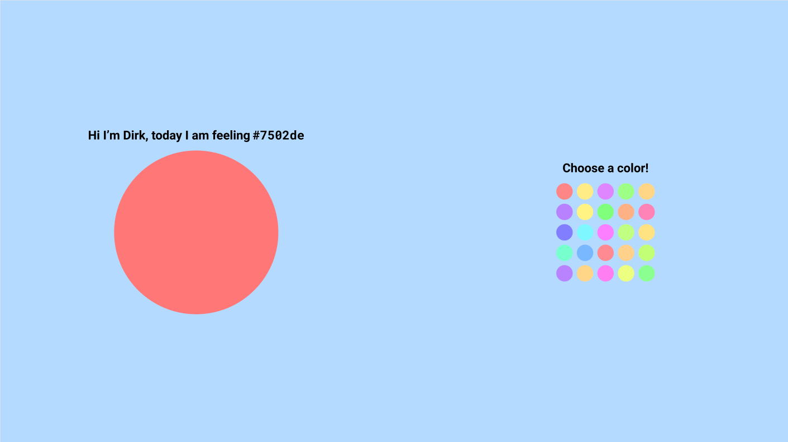

# Legal OS React Tech Test

__Don't forget to run `npm install` before starting__

Hi there! Thanks for doing our tech test.

The exercise you will be doing today is to create a tiny single-page app. Please see designs for what it should look like:

Important to note:

- The user should be able to pick a color by clicking one of the colors on the right
- When a color is picked, Dirk should be the new color and he should express his new ways of feeling as well
- What colors are in the color picker are not important, feel free to choose
- The app needs to work on any PC screen in landscape mode
  - Minimal resolution 1280 x 720
  - Maximal resolution 3840 x 2160
- Feel free to use any libraries you feel you need.
- Dirk is centered on left side screen, color picker is centered on right side of screen
- Both are centered vertically
- Dirk is `400px` by `400px`
- Color buttons are `40px` by `40px`
- Space between color buttons is `10px`
- Texts are in `Roboto` font, except for the hex code which is in a mono-space code font.
- Both texts are 2nd level header.

### Thanks:

This project was bootstrapped with [Create React App](https://github.com/facebook/create-react-app).
